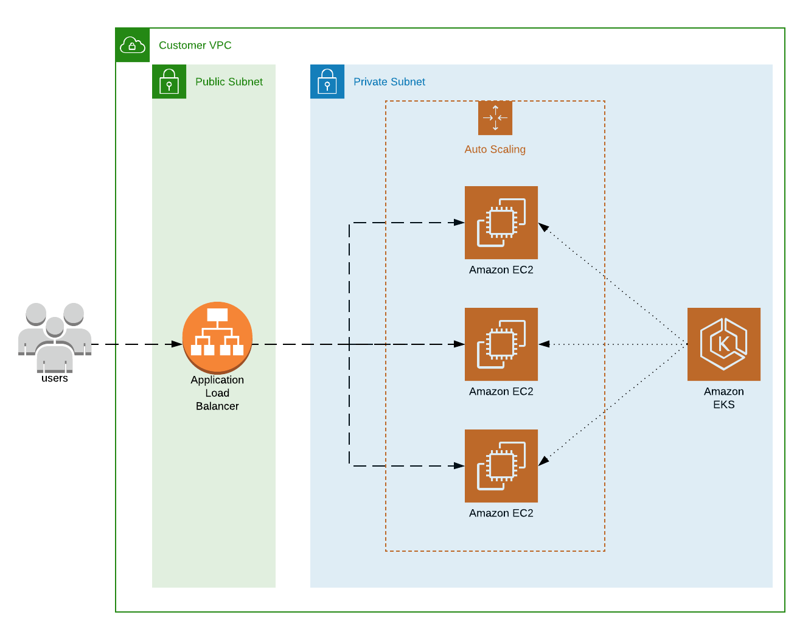

# EKS running on spot instances 
This repo contains the material you need to get an EKS cluster up and running while savin' some money using spot instances. In this workshop we will create a new VPC which contains an EKS Cluster exposed by an Application Load Balancer. 



## Step 0: Install aws-cli, kubectl and aws-iam-authenticator
Install the aws-cli:
https://docs.aws.amazon.com/cli/latest/userguide/install-cliv2.html

Install kubectl and aws-iam-authenticator by following the steps in:
https://docs.aws.amazon.com/eks/latest/userguide/managing-auth.html

## Step 1: Create a VPC
Deploy a stack of _cf-templates/vpc-setup.yaml_. For the purpose of this workshop, name the stack _MyVpcStack_.

The stack will create a new VPC, with public and private subnets in all three availability zones. 

Specify to create 0, 1 or 3 NAT-Gateways. NAT-Gateways are coupled to subnets, therefore specify 1 Gateway for develop or UAT environments, and choose 3 for redundancy if the setup is for production. Use the default parameter values in this workshop.

## Step 2: Create an EKS Cluster
Deploy a stack of _cf-templates/eks-cluster.yaml_. For the purpose of this workshop, name the stack _MyClusterStack_ and use the default parameter values.

The stack creates the resources:
* An EKS Cluster with a security group and service role 
* A security group to be used by the nodegroups
* A nodegroup instance role the be used by the nodegroups
* Ingress and egress rules to enable secure traffic between the EKS Cluster and the node group, and to allow the nodes to communicate with each other. 

Head to your terminal and update your context by adding the created Cluster:
```
aws eks --region YOUR_REGION update-kubeconfig --name YOUR_CLUSTERNAME
```

Verify you can connect to the created cluster:
```
kubect get svc
```

### Step 3: Configure the Auth ConfigMap
To grant additional AWS users or roles the ability to interact with your cluster, you must edit the aws-auth ConfigMap within the cluster. This includes the roles used by the nodegroups.

Add the IAM Role used by the nodegroups by modifying the _k8s/aws-auth-cm.yaml_ file.
You can find the node instance role arn in the outputs of the deployed eks-cluster stack.

When the _k8s/aws-auth-cm.yaml_ file has been modified with the node instance role arn:
```
kubectl apply -f k8s/iam/aws-auth-cm.yaml
```

## Step 4: Deploy a Load Balancer
Deploy a stack of _cf-templates/load-balancer.yaml_. 

The stack creates the resources:
* An Application load balancer with the specified scheme. 
* A security group attached to the ALB that accepts all incoming traffic
* An Ingress rule that is added to the nodegroups security group, to allow all traffic from the load balancer on the specified ingress port.

The internet-facing scheme option will deploy the load balancer in the public subnets, while internal deploys it in the private subnets.

## Step 5: Deploy a Nodegroup
Create an ec2 key-pair using the AWS console.

Deploy a stack of _cf-templates/eks-spot-group.yaml_. Use the default parameters. The name of the stack is of no importance.

The stack creates the resources:
* A LaunchTemplate
* An Auto scaling group _(that spans one availability zone, this is explained why in the Cluster Autoscaler section)_
* Cloudwatch alarms and a scale policy on CPU and Memory. _(Deploy a cloudwatch agent to utilize the memory alarm)_

The most interesting bit of this template is the _MixedInstancesPolicy_ section of the NodeGroup resource. In this section we specify the base capacity of OnDemand instances and what spot instance pools we would want to use. This workshop only utilizes two spot pools. The _LaunchTemplate/Overrides_ element is not a dynamic list, which means you need to modify the template to select a bigger number of spot pools. 

The User data script of the LaunchTemplate resource labels the instances with matching labels: _lifecycle=Ec2Spot_ and _lifecycle=OnDemand_. This is to be able to schedule pods upon instance type. It also uses the cfn-signal helper script and corresponding UpdatePolicy for smooth cloudformation updates.

Verify the nodes have been added to the cluster:
```
kubectl get nodes
```

## Step 6: Test the setup
Deploy both the httpbin deployment and service templates. Navigate to _k8s/httpbin_ and run:
```
kubectl apply -f k8s/httpbin/httpbin-deploy.yaml 
kubectl apply -f k8s/httpbin/httpbin-svc.yaml 
```

Make a GET request to the Load Balancer URL via cURL or your browser.

## Metrics server
The system metrics are not available by default. To visualize this we will add a Horizontal Pod Autoscaler to the httpbin application:
```
kubectl apply -f k8s/httpbin/httpbin-hpa.yaml 
```

To see the status of the autoscaler, run:
```
kubectl get hpa
```

The Horizontal Pod Autoscaler will not receive any metrics. To fix this we will deploy the metrics server:
```
kubectl apply -f k8s/metrics-server/metrics-server.yaml
```

Wait for a minute and check the status again:
```
kubectl get hpa
```

## Deploy kube2iam
By default, the pods will be granted the IAM access specified by the Node Instance Role. Although it is feasible to use this as a big mono-role that grants the necessary permissions for all pods in the cluster, this goes strictly against the holy [least privilege principle](https://docs.aws.amazon.com/IAM/latest/UserGuide/best-practices.html#grant-least-privilege). By using an open-source solution, namely _kube2iam_, we can achieve granular IAM management by assigning specific roles to pods. Kube2iam is a DaemonSet that intercepts the calls made pods using the AWS client libraries to the EC2 metadata service. Based on pod annotations it will receive credentials of specific roles.  

Deploy the kube2iam daemonset:
```
kubectl apply -f k8s/iam/kube2iam.yaml --namespace kube-system
```

Make sure the daemonset is up and running:
```
kubectl get pods -n kube-system
```

The Node Instance Role must have an AssumeRole policy attached to it that allows it to assume roles of a specific prefix. As specified in the previously deployed _cf-templates/eks-cluster.yaml_, our node instance role is given the permission to assume roles of the prefix _k8s-_. The role assigned to the pod must in turn be given the trust relationship to be assumed by the Node Instance Role. An example of this is shown in _k8s/cluster-autoscaler/cluster-autoscaler-role.yaml_.

AWS has announced granular IAM by utilizing OIDC and ServiceAccounts. However, only recent versions of AWS SDK:s will check OIDC credentials in the default credentials chain. Further reading: 
https://docs.aws.amazon.com/eks/latest/userguide/enable-iam-roles-for-service-accounts.html

## Cluster Autoscaler
The right way to scale the cluster vertically, is not by using the standard installation of the cloudwatch agent and using a combination of cloudwatch alarms and metrics. Instead, we will use the kubernetes cluster-autoscaler. The cluster-autoscaler is a deployment that will scale up the cluster when pods are not being able to be scheduled due to lack of resources. It also scales the cluster down intelligently by gracefully draining the "least important" node and updating the corresponding AWS Autoscaling group.

The autoscaler has one drawback; it is not reliable with cross-AZ NodeGroups. This is due to its _intelligent_ downscaling not taking the AWS [rebalancing feature](https://docs.aws.amazon.com/autoscaling/ec2/userguide/auto-scaling-benefits.html#arch-AutoScalingMultiAZ) into account. The workaround is to use one Autoscaling group for each availability zone, and to set the _--balance-similar-node-groups_ flag in the cluster-autoscaler deployment file.

Navigate to the AWS console and deploy a stack of _k8s/cluster-autoscaler/cluster-autoscaler-role.yaml_. Give the stack a name of your choosing and use the default parameter.

Deploy the cluster-autoscaler deployment:
```
kubectl apply -f k8s/cluster-autoscaler/cluster-autoscaler.yml
```

Make sure the pod is up and running:
```
kubectl get pods -n kube-system
```

Update the _min_ value of the k8s/httpbin/httpbin-hpa.yaml file to 70. And then update the HPA:
```
kubectl apply -f k8s/httpbin/httpbin-hpa.yaml 
```

In a couple of minutes, we should see the autoscaler scaling up the cluster.

## Spot Interrupt Handler
Spot instances can be interrupted at any given time by AWS. However, the spot instance is given an interruption notice two minutes ahead through the ec2 metadata endpoint.

The Spot interrupt handler polls this status every 5 seconds and gracefully drains the node if the termination status is received. It also deregisters the instance from the load balancer target group. 

Navigate to the AWS console and deploy a stack of _k8s/spot-interrupt-handler/spot-interrupt-handler-role.yaml_. Give the stack a name of your choosing and use the default parameter.

If your doing this workshop on your own; clone the repo: https://github.com/andreniklasson/k8s-spot-interrupt-handler and build the docker image. Push it to your own ECR or a registry of your choice. Insert your image URI in the _k8s/spot-interrupt-handler/spot-interrupt-handler.yaml_ template.

Deploy the spot-interrupt-handler:
```
kubectl apply -f k8s/spot-interrupt-handler/spot-interrupt-handler.yaml
```

## Network policy with Calico
Calico is a network policy engine for Kubernetes. Network policies works in the same way as security groups in AWS, but inside the cluster. You assign network policies to pods using pod selectors and labels

```
kubectl apply -f https://raw.githubusercontent.com/aws/amazon-vpc-cni-k8s/release-1.5/config/v1.5/calico.yaml
```

Make sure the DaemonSet is up and running:
```
kubectl get daemonset calico-node --namespace kube-system
```

_An example of using network policies is on my TODO list..._